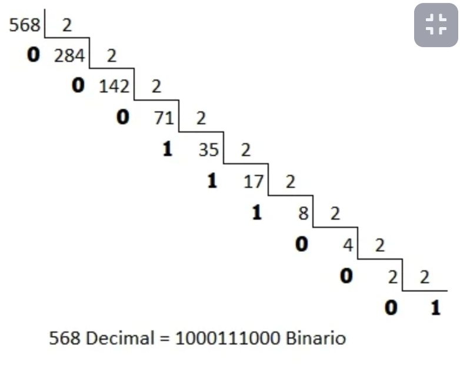

# algoritmosYDiagramasDeFlujo

# 1. Introduction

What is a Operation?
A operation is a process to get a expected result.

# 2. Binary system

In our school we knew the Decimal system:

- 0,1,2,3,4,5,6,7,8,9

What is Binary System?
Is a numeric system based ob two symbols:

- 1 means **true** or **turn on**
- 0 means **false** or **turn off**

**Conversion between Decimal and Binary Systems**

- Decimal to Binary system
  

- Binary to Decimal system
  

**Plus on Binary System**

Four rules when we add on binary system

- 0 + 0 = 0
- 1 + 0 = 1
- 0 + 1 = 1
- 1 + 1 = 0 ( and reserve 1)

**Subtract on Binary System**

Four rules when we subtract on binary system

- 0 - 0 = 0
- 1 - 0 = 1
- 0 - 1 = 1 ( and reserve 1)
- 1 - 1 = 0

**Multiply on Binary System**

- 0 \* 0 = 0
- 1 \* 0 = 0
- 0 \* 1 = 0
- 1 \* 1 = 1

# 3. Operator

# 4. Algorithms and flow diagrams

# 5.
